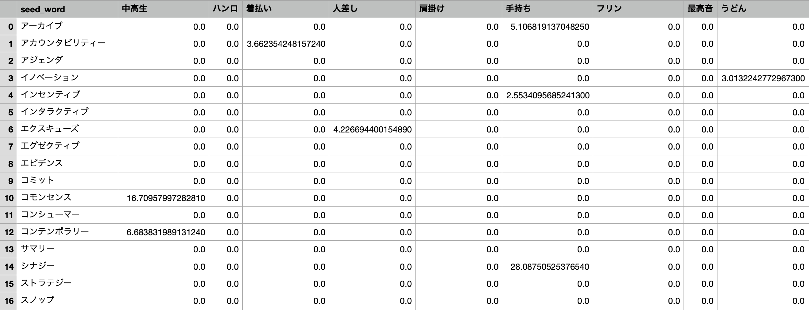

# Building a Webscraper for Question & Answer Forum

To solve any business problem or research question using data science, the first step is to collect your data.
Web scraping is the process of extracting and parsing data from websites in an automated fashion using a computer program.

In this application of webscraping, I built a web scraper that collects the question and best answer to questions from yahoo answers based on a list of search terms. A webscraper like this can be used for several different uses, such as expanding the corpus of an automatic speech recognition model to take into account domain specific words. 

After the webscraping, to increase useability, I separated the yahoo answer observations by sentence segment. I then cleaned these segments of urls and other noise. I then calculated the term frequency, document frequency and term frequency - inverse document frequency values to prep the corpus for analysis. This webscraping script uses selenium, pandas, BeautifulSoup & MeCab (Japanese Morpholoical Analyzer).

The yahoo answers website we will be scraping looks as such. Looping through the search terms, we will search the most relavent answers to each search term .

For each search term we will be collecting the url links for 10 pages worth of search results.

Then we will be scraping each url for the best answer at the top of the page. 

There are 4 scripts in this webscraping process.
[To see the scripts & results please visit the github repository for this project.](https://github.com/haruka-takagi-datascience/yahoo_webscraper)

### yahoo_webcrawl_1.py
This script collects urls from yahoo answer page search. With a maximum of 300 urls per search term.
This script outputs a dataframe of seed_word, rank, url and word_id.

### yahoo_webcrawl_2.py
This script scrapes html files for saving from url list from yahoo_webcrawl_1.py
This script outputs a folder of saved html files.

### yahoo_webcrawl_3.py
This script extracts the question and best answer from each html file.
This script outputs url_df.csv with a new added text column showing the scraped text. 
 

### yahoo_webcrawl_4.py
This script does the following processes in the order listed below.
1. Cleans text (url_df_cleaned.csv)
2. Segments text into sentence sequences (sequence_webcrawl_cleaned_df.csv)
3. Creates nouns list for tf-idf (nouns_list_all.txt)
4. Create term frequency for each noun over the same seed words (tf_by_seed_df.csv)
5. Create document frequency for each noun (df_by_all.csv)
6. Create idf (df_by_all.csv)
7. Create tf_idf data frame by seed word for all nouns (tf_idf_by_seed.csv)

## RESULTS
### url_df_cleaned.csv
This csv contains the url, rank, original text and cleaned text of yahoo answer websearch.
- seed_word: seed word
- rank: rank in yahoo search result
- url: url of yahoo answers search
- word_id : numerical id of seed word (detailed in word_df)
- html_s3_url : s3 link to saved html of yahoo search results
- text : string of scraped text from yahoo search results (includes the question and the best answer to question) (NOT CLEANED)
- segmented_text : list of text segmented by sentence (CLEANED)
- sequence_length : number of sentences in text (numerical)
- segmented_text_joined : joined string of segmented_text (CLEANED)

 
### sequence_webcrawl_cleaned_df.csv
This csv ontains the url, rank, and cleaned sequence text of yahoo answer web search.
- seed_word : seed word
- rank : rank in yahoo search result
- seq_sentence_n : nth sequence value
- cleaned_segmented_text : cleaned text sequence by sentence

### nouns_list_all.txt
List of all nouns in yahoo answer web search. (tokenized with Mecab)

### tf_by_seed_df.csv
This csv contains term frequency for all nouns by seed word.
- seed_word : seed word
- tf_by_seed(セーフガード) : セーフガード term frequency by seed word
- tf_by_seed(ウォリアーズ) : ウォリアーズ term frequency by seed word
- continues of all nouns in noun list

### df_by_all.csv
This csv contains document frequency and inverse document frequency (idf) for all nouns
- words : all nouns in yahoo web search ( from nouns_list_all.txt)
- document_frequency : number of appearances of nouns across all documents (documents = yahoo answers search results)
- idf : inverse document frequency for all nouns across all documents (idf = log(N - n - 0.5)/(n + 0.5) for N = number of documents & n = df(noun)

### tf_idf_by_seed.csv
This csv contains tf_idf by seed for all nouns in yahoo web search
- seed_word : seed word
- セーフガード : tf_idf of noun ( セーフガード ) by seed word
- ウォリアーズ: tf_idf of noun ( ウォリアーズ ) by seed word
- continues of all nouns in noun list

Thank you for reading!
